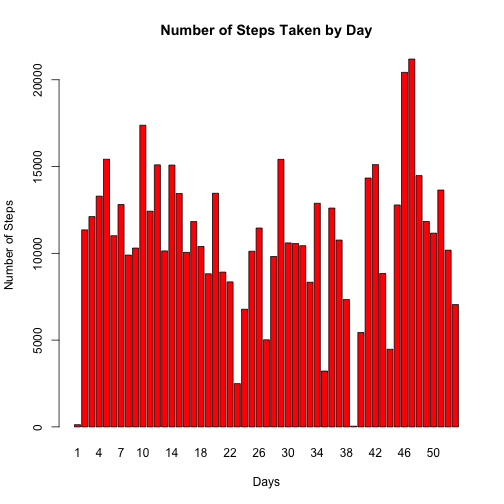
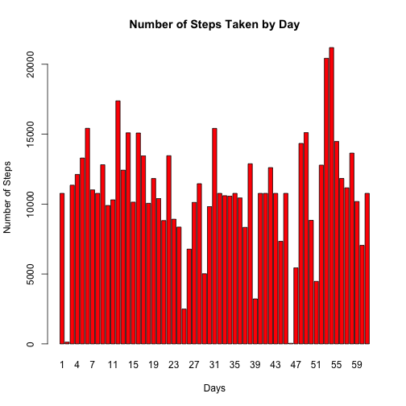
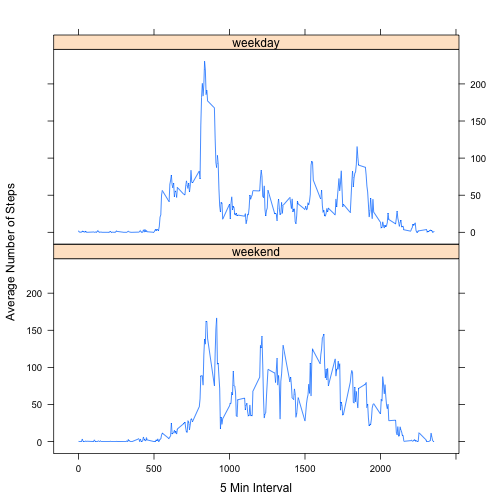

Peer Assesment Assignment #1
============================

# Introduction

This is the R Markdown document for the first peer assesment assignment. It is broken down into multiple steps,  
with different actions required at each step.

1. Read in data file and perform any preprocessing
2. Create a histogram of the number of steps taken by day and calculate the mean/median number of steps taken over the entire time period
3. Create a time series plot of the average steps taken by 5 minute time interval and determine the interval with the most steps taken
4. Replacing missing data points:
- Calculate the number of missing data points
- Create a scheme to replace the missing data
- Create a new dataset with the missing values replaced using the scheme devised in last step
- Create a histogram of the number of steps taken by day and calculate the mean/median number of steps taken over the entire time period
5. Create a new column in dataset indicating if the date is a weekday or weekend day. Using the new dataset, create a panel plot showing time series plots of the average number of steps taken by 5 minute time interval

## Step One: Reading in file

This step is straightforward for this assignment, as processing will take place in the following steps and we only need to read in the file. I created a variable for the file name to use when calling the read.csv() function, but it isn't really necessary. I am assuming the data file is in the working directory.


```r
file <- "activity.csv"  # create variable for file name
data <- read.csv(file)  # read in file
```

## Step Two: Creating a histogram and calculating mean/median number of steps

I began by removing the intervals with NA value for steps. I then used the aggregate() function to add the number of steps by the day. I renamed the resulting dataset column names to make it easier to work with and created a vector, "days", to use as the x-axis data to make the histogram plot easier to read. Once this was done, I created a histogram plot using the barplot() function to plot the number of steps taken by day for the dataset time period.


```r
library("data.table")  # load data.table library to use setnames() function
```

```
## Warning: package 'data.table' was built under R version 3.1.3
```

```
## data.table 1.9.4  For help type: ?data.table
## *** NB: by=.EACHI is now explicit. See README to restore previous behaviour.
```

```r
data1 <- data[complete.cases(data),]  # remove the NA data from dataset and put in new dataset
stepsbyDay <- aggregate(data1$steps ~ data1$date, FUN = sum)  # sum the number of steps by date
setnames(stepsbyDay,1:2,c("date","steps"))  # rename dataset columns
days <- c(1:nrow(stepsbyDay))  # create vector from 1 to number of days in dataset to use for x-axis data
barplot(stepsbyDay$steps,names.arg = days, col = "red",main = "Number of Steps Taken by Day",
        ylab = "Number of Steps",xlab = "Days")  # plot histogram of steps taken per day
```

 

The next operation to perform was calculating the mean of the total number of steps taken.


```r
meansteps <- mean(stepsbyDay$steps)  # calculate the mean of the total number of steps
meansteps  # display the mean calculation result
```

```
## [1] 10766.19
```

And the median value for the total number of steps taken.


```r
mediansteps <- median(stepsbyDay$steps)  # calculate the median number of total steps taken
mediansteps  # display the median calculation result
```

```
## [1] 10765
```


## Step Three: Create time series plot and determine the interval with most number of steps

Using the dataset with NA values removed, I used the aggregate() function to calculate the mean number of steps by 5 minute time interval. Similar to the previous step, I renmaned the columns in the resulting dataset. I then created a time series plot of the average number of steps taken for the 5 minute time intervals.


```r
stepsbyInterval <- aggregate(data1$steps ~ data1$interval,FUN = mean)  # average the steps taken over time intervals
setnames(stepsbyInterval,1:2,c("interval","avgsteps"))  # rename column names
plot(stepsbyInterval$interval,stepsbyInterval$avgsteps,type = "l",
     ylab="Average Number of Steps",xlab="5 Min Interval")  # create time series plot
```

 

Determine the time interval with highest average number of steps.


```r
maxstepsInterval <- stepsbyInterval$interval[which.max(stepsbyInterval$avgsteps)]  # find interval with max avg
maxstepsInterval  # display interval with max avg number of steps
```

```
## [1] 835
```


## Step Four: Find number of NA entries, create scheme to replace them, create new dataset, plot histogram, and calculate mean/median

Using original dataset, I calculated the number of NA entries.


```r
numofNA <- sum(is.na(data$steps))  # calculate number of NA entries
numofNA  # display number of NA entries found
```

```
## [1] 2304
```

To replace the NA entries, I decided to use the average number of steps for each time interval and insert them. I used the ifelse() function to do the replacements, taking the time interval averages calculated in a previous step.


```r
data2 <- data  # create a new dataset based on original data
data2$steps <- ifelse(is.na(data2$steps),stepsbyInterval$avgsteps,data2$steps)  # replace NA entries
```

I then had to run through the steps performed in Step One to create a histogram plot based on the new dataset and calculate the new mean/median values.


```r
stepsbyDay <- aggregate(data2$steps ~ data2$date, FUN = sum)  # sum the number of steps by day
setnames(stepsbyDay,1:2,c("date","steps"))  # renmae column names
days <- c(1:nrow(stepsbyDay)) # create vector to use for x-axis data
barplot(stepsbyDay$steps,names.arg = days, col = "red",main = "Number of Steps Taken by Day",
        ylab = "Number of Steps",xlab = "Days")  # create histogram plot of new dataset
```

 


```r
meansteps2 <- mean(stepsbyDay$steps)  # calculate the mean of total steps taken
meansteps2 # display the mean 
```

```
## [1] 10766.19
```


```r
mediansteps2 <- median(stepsbyDay$steps)  # calculate the median of total steps taken
mediansteps2  # display the median
```

```
## [1] 10766.19
```

Replacing the NA values with the averages for each time interval didn't change the mean but did change the median a small amount. With the NA values replaced, the total number of steps taken over the time period have increased. For other data analysis, you would certainly have to put a lot of thought into how you replace missing data, making sure you don't skew the results too much.


## Step Five: Add column to show if date is a weekday or a weekend day, create panel with time series plots showing average number of steps for time intervals on weekdays and weekends

Using the new dataset created in the last step, I created a new column to indicate if the interval was during a weekday or a weekend day.


```r
data2$date <- as.Date(data2$date)  # force date column into correct format
weekdaysvec <- c('Monday',"Tuesday","Wednesday","Thursday","Friday")  # create a vector to identify the weekdays
data2$weekday <- factor((weekdays(data2$date) %in% weekdaysvec),
                             levels=c(FALSE,TRUE),labels=c("weekend","weekday")) # create new column
```

The next step was to average the number of steps taken over time intervals and weekday/weekend criteria.


```r
stepsbyInterval <- aggregate(data2$steps ~ data2$interval+data2$weekday, FUN = mean)  # find avg over interval and
                                                                                      # weekday/weekend
setnames(stepsbyInterval, 1:3,c("interval","weekday","steps"))  # rename column names
```

Loading lattice package, I used xyplot() function to create panel plot of the weekday and weekend periods showing the average number of steps for the 5 minute time intervals.


```r
library("lattice")  # load lattice package
```

```
## Warning: package 'lattice' was built under R version 3.1.3
```

```r
xyplot(steps ~ interval|weekday, data = stepsbyInterval, type = "l", xlab = "5 Min Interval", 
       ylab = "Average Number of Steps", layout = c(1,2))  # create panel of time series plots
```

 
